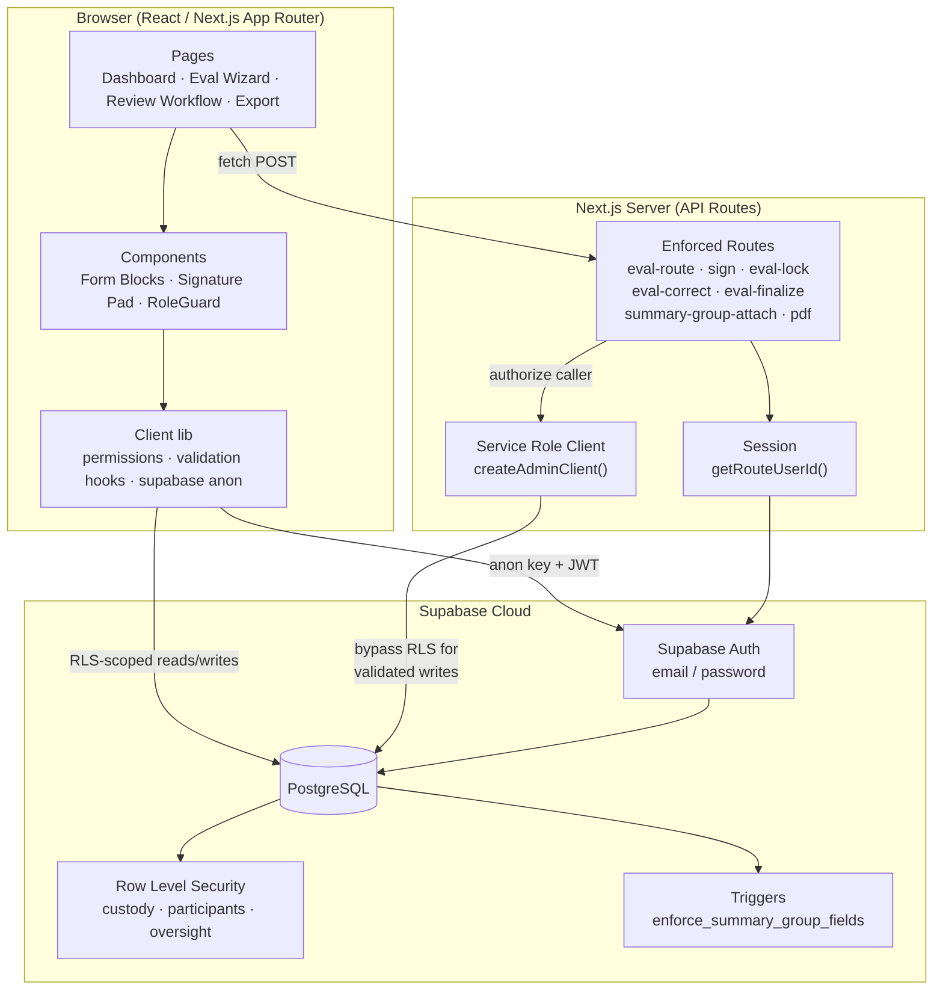
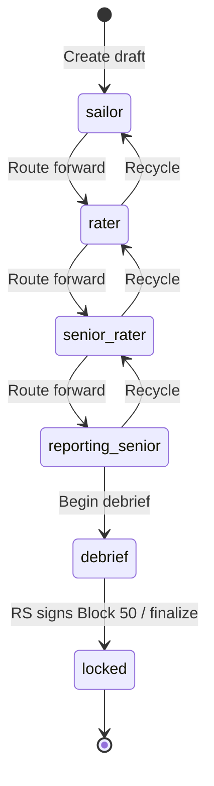
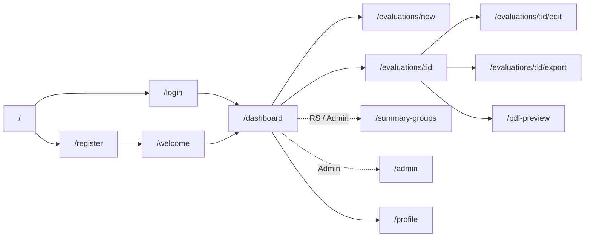
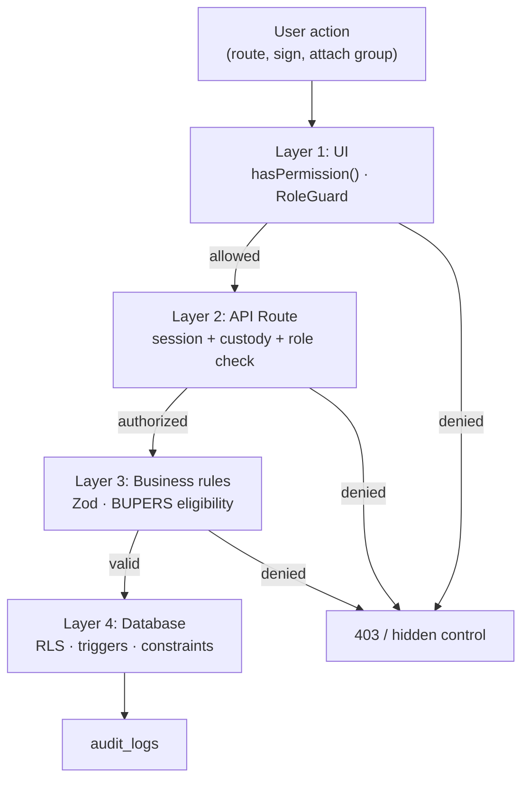
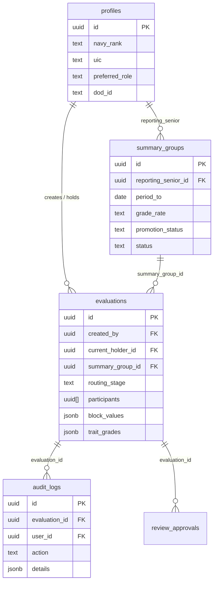

# APEX — System Architecture Diagram

Use this figure in **Section A** (Software Standards) or **Section C** (UI/Design) of the milestone PDF. Export the Mermaid diagram as PNG/SVG using [mermaid.live](https://mermaid.live) or a VS Code Mermaid extension.

---

## Figure A-1. APEX High-Level Architecture

**Suggested caption:** *Figure A-1. APEX three-tier architecture — React/Next.js client, authenticated API routes with server-side authorization, and Supabase Postgres with Row Level Security.*



---

## Figure A-2. Evaluation Routing State Machine

**Suggested caption:** *Figure A-2. Custody routing stages — each transition is authorized by role and recorded in audit_logs.*



---

## Figure A-3. Application Navigation Map

**Suggested caption:** *Figure A-3. Primary navigation structure — role-gated entries shown in dashed boxes.*



---

## Figure A-4. Security Layers (Defense in Depth)

**Suggested caption:** *Figure A-4. Security enforcement layers applied to every sensitive evaluation action.*



---

## Figure A-5. Data Model (Core Entities)

**Suggested caption:** *Figure A-5. Core database entities and relationships for evaluations, profiles, and summary groups.*



---

## How to Export for PDF

### Option A — Mermaid Live Editor
1. Open https://mermaid.live
2. Paste diagram code from above
3. Export → PNG or SVG
4. Insert into Word/Google Docs at ~6.5" width

### Option B — VS Code
1. Install “Markdown Preview Mermaid Support”
2. Preview this file
3. Screenshot or use export extension

### Option C — ASCII (fallback if Mermaid export unavailable)

```
┌─────────────────────────────────────────────────────────────┐
│                    BROWSER (React / Next.js)                 │
│  Dashboard · Eval Wizard · Review Workflow · PDF Export      │
└───────────────────────────┬─────────────────────────────────┘
                            │ HTTPS
┌───────────────────────────▼─────────────────────────────────┐
│              NEXT.JS API ROUTES (authorized)                 │
│  eval-route · sign · eval-lock · summary-group-attach · pdf  │
└───────────────────────────┬─────────────────────────────────┘
                            │ service role (after auth check)
┌───────────────────────────▼─────────────────────────────────┐
│                    SUPABASE (Auth + Postgres)                │
│  RLS · audit_logs · triggers · summary_groups                │
└─────────────────────────────────────────────────────────────┘
```

---

## Recommended Figures for 7–10 Page PDF

| Include | Figure | Page estimate |
|---------|--------|---------------|
| Required | A-1 High-Level Architecture | 0.5 page |
| Required | A-3 Navigation Map | 0.25 page |
| Optional | A-2 Routing State Machine | 0.25 page |
| Optional | A-4 Security Layers | 0.25 page |
| Optional | A-5 Data Model | 0.5 page |

**Minimum for rubric:** A-1 + A-3 plus 8 UI screenshots from `02-screenshot-capture-list.md`.

---

*End of architecture diagram document.*
