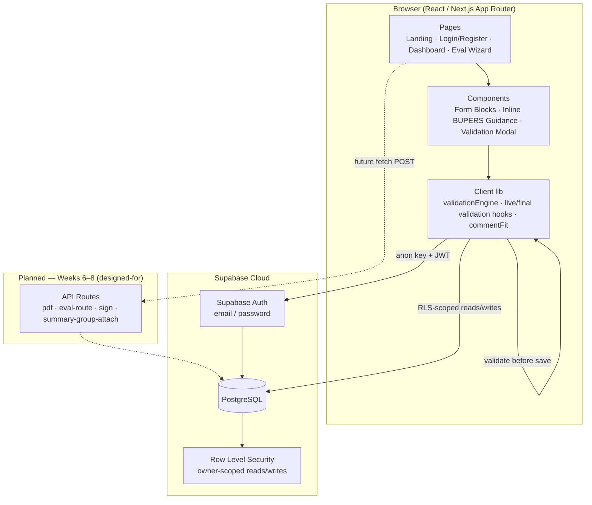
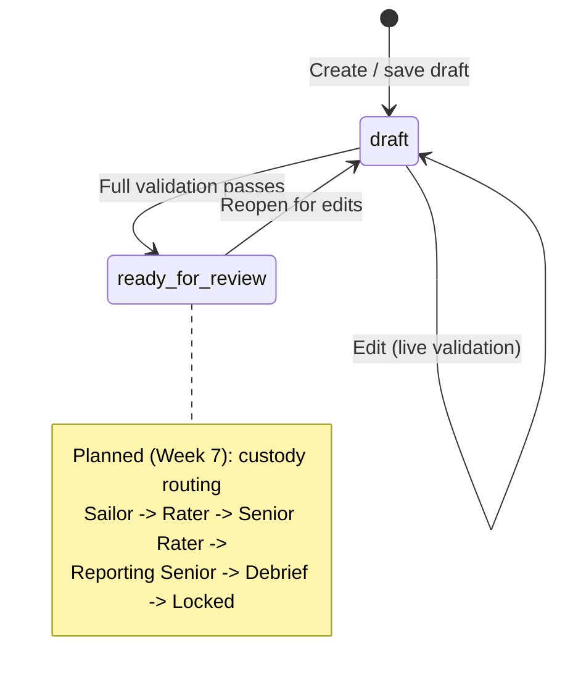
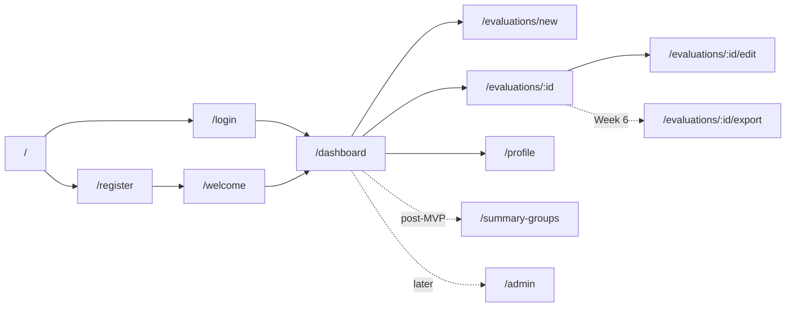
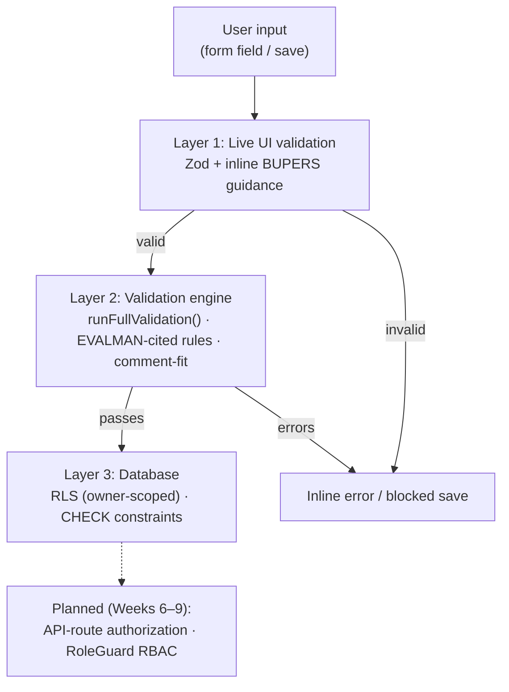
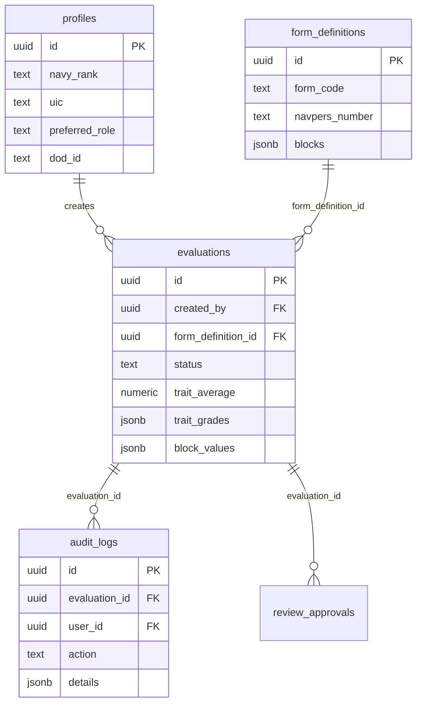

# APEX — System Architecture Diagram (Through Week 5)

Use this figure in **Section A** (Software Standards) or **Section C** (UI/Design) of the milestone PDF. Export the Mermaid diagram as PNG/SVG using [mermaid.live](https://mermaid.live) or a VS Code Mermaid extension.

> **Week 5 scope:** The solid nodes show what is built and demonstrable at Week 5 (auth, the EVAL wizard, the validation engine, and Supabase with RLS). Dashed “Planned” nodes show the Week 6–8 layers (PDF export, server-enforced routing/signing, summary groups) that the architecture is designed to accept without restructuring.

---

## Figure A-1. APEX High-Level Architecture

**Suggested caption:** *Figure A-1. APEX architecture at Week 5 — a React/Next.js client with a client-side validation engine over Supabase Postgres with Row Level Security. Server-enforced API routes are designed-for and arrive in Weeks 6–8 (dashed).*



---

## Figure A-2. Evaluation Status Lifecycle (Week 5)

**Suggested caption:** *Figure A-2. Week 5 evaluation status lifecycle — a draft becomes ready_for_review once the full validation pass succeeds. The full multi-stage custody routing chain is a Week 7 extension (dashed).*



---

## Figure A-3. Application Navigation Map

**Suggested caption:** *Figure A-3. Week 5 navigation structure. Dashed routes are implemented for later-week reveals (export, summary groups, admin).*



---

## Figure A-4. Validation Layers (Defense in Depth)

**Suggested caption:** *Figure A-4. Week 5 validation enforcement — live UI validation, the EVALMAN-cited rules engine, and database constraints/RLS. Server-route authorization and RBAC are added in Weeks 6–9 (dashed).*



---

## Figure A-5. Data Model (Week 5 — Migration 001)

**Suggested caption:** *Figure A-5. Core entities from the initial schema (migration 001). The summary_groups table and evaluation custody columns are added in migration 002 for the Week 7 routing feature.*



---

## How to Export for PDF

### Option A — Mermaid Live Editor
1. Open https://mermaid.live
2. Paste diagram code from above
3. Export → PNG or SVG
4. Insert into Word/Google Docs at ~6.5" width

### Option B — VS Code
1. Install “Markdown Preview Mermaid Support”
2. Preview this file
3. Screenshot or use export extension

### Option C — ASCII (fallback if Mermaid export unavailable)

```
┌─────────────────────────────────────────────────────────────┐
│                    BROWSER (React / Next.js)                 │
│  Landing · Login/Register · Dashboard · EVAL Wizard          │
│  Validation engine + comment-fit run client-side            │
└───────────────────────────┬─────────────────────────────────┘
                            │ HTTPS (anon key + JWT)
┌───────────────────────────▼─────────────────────────────────┐
│                    SUPABASE (Auth + Postgres)                │
│  Row Level Security (owner-scoped) · CHECK constraints       │
│  profiles · evaluations · form_definitions · audit_logs      │
└─────────────────────────────────────────────────────────────┘
   · · · Planned (Weeks 6–8): Next.js API routes for PDF,
         server-enforced routing/signing, and summary groups · · ·
```

---

## Recommended Figures for the Week 5 PDF

| Include | Figure | Page estimate |
|---------|--------|---------------|
| Required | A-1 High-Level Architecture (Week 5) | 0.5 page |
| Required | A-3 Navigation Map | 0.25 page |
| Optional | A-2 Status Lifecycle | 0.25 page |
| Optional | A-4 Validation Layers | 0.25 page |
| Optional | A-5 Data Model (Migration 001) | 0.5 page |

**Minimum for rubric:** A-1 + A-3 plus the 8 UI screenshots from `02-screenshot-capture-list.md`.

---

*End of architecture diagram document.*
